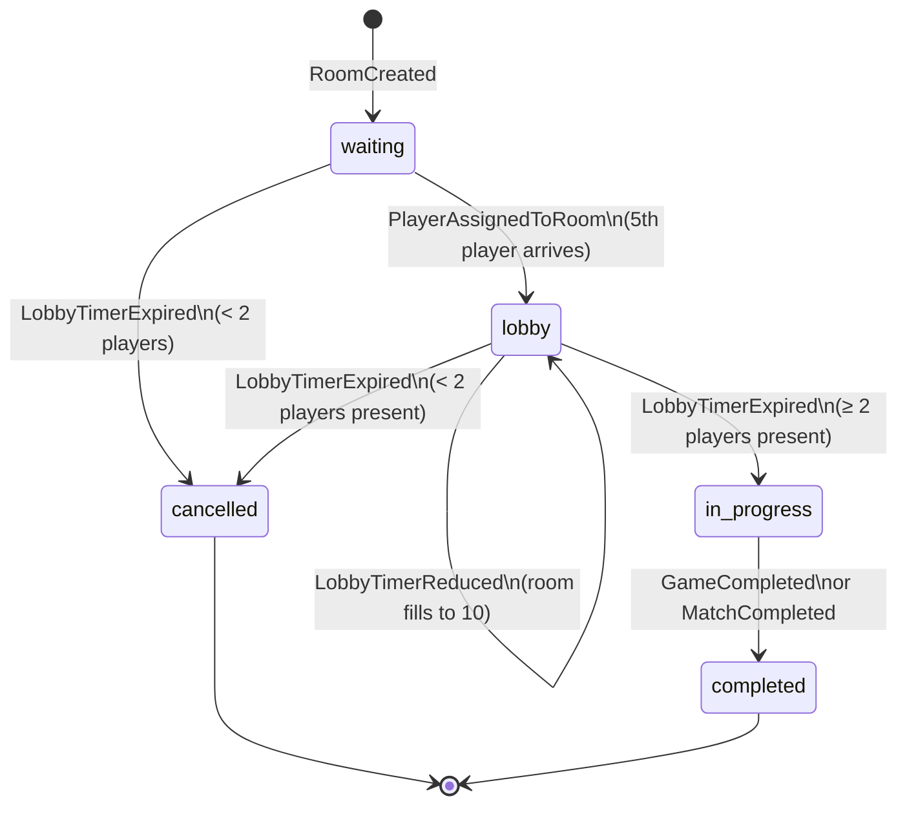
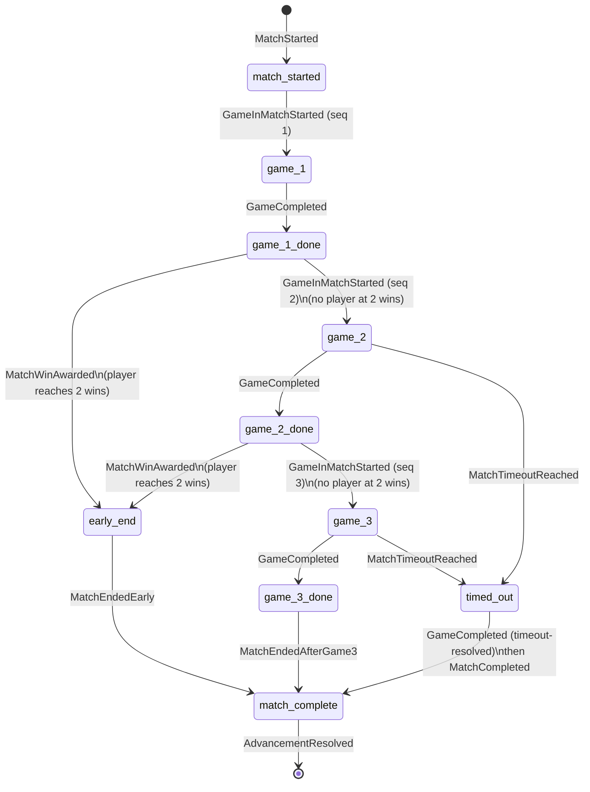

# UnoArena — EventStorming Diagrams & Flow Charts

Visual artifacts for the UnoArena domain model. All terms follow [GLOSSARY.md](./GLOSSARY.md).

---

## Notation Legend

EventStorming sticky notation used in boards below:

```
[CMD: Name]     Command      — intent to change state (blue)
(EVT: Name)     Domain Event — something that happened (orange)
{POL: Name}     Policy       — reaction rule: "when event X, do Y" (purple)
<AGG: Name>     Aggregate    — consistency boundary (yellow)
[RM: Name]      Read Model   — query-optimized projection (green)
(ACT: Name)     Actor        — who issues the command (person)
──▶             causes / produces
~~▶             async / eventual
- - ▶           conditional / branching path
```

---

## 1. Room Lifecycle State Machine



---

## 2. Match Lifecycle in Tournament



---

## 3. Turn Lifecycle & Timer Windows

This diagram shows the timing relationships between the turn timer and the three challenge window types.

### 3.1 Normal Turn (no special card)
```
t=0                                           t=45s
 │                                               │
 ├─────────────── 45s TURN TIMER ───────────────┤
 │                                               │
 │  Player acts ──▶ CardPlayed ──▶ TurnAdvanced  │
 │  (before timer expires)                       │
 │                                               │
 │  [if timer expires for connected player]      │
 │  ──▶ CardDrawn (auto-draw) ──▶ TurnAdvanced   │
 │  AFK counter +1                               │
```

### 3.2 Uno! Challenge Window (runs CONCURRENTLY with next player's turn timer)
```
t=0                  t=5s                    t=45s
 │                    │                         │
 ├── 45s TURN TIMER (next player B) ───────────┤
 ├── 5s UNO! WINDOW ─┤                         │
 │                    │                         │
 │  Any opponent may ChallengeUno ──────────────── closes window early
 │  Target player A may CallUno ────────────────── window stays open
 │  Player B may act ───────────────────────────── closes window early
 │                    │
 │  [window expires]  │
 │  ──▶ ChallengeWindowClosed
 │  (no penalty regardless of whether A called Uno!;
 │   penalty only applies on a successful active challenge)
 │
 │  B's 45s timer continues running through all of this
```

### 3.3 Wild Draw Four Challenge Window (runs BEFORE next player's turn timer)
```
t=0           t=5s  t=5s+resolve            t=5s+resolve+45s
 │              │         │                        │
 ├── 5s WD4 ───┤         ├──── 45s TURN TIMER ────┤
 │   WINDOW     │         │    (next player D)      │
 │              │         │                        │
 │  Only D may ChallengeWildDrawFour ────────── closes window early
 │  D may draw 4 (waive challenge) ──────────── closes window early
 │              │
 │  [window expires, no challenge]
 │  ──▶ PenaltyCardsDrawn (4 to D)
 │  ──▶ ChallengeWindowClosed
 │  ──▶ TurnAdvanced (D's turn skipped)
 │              │
 │              └──▶ Next player's 45s timer starts HERE
```

### 3.4 Combined Window: WD4 as Second-to-Last Card (runs BEFORE next player's turn timer)
```
t=0                    t=5s (or earlier)       t=5s+resolve+45s
 │                          │                        │
 ├──── 5s COMBINED WINDOW ──┤  ├── 45s TURN TIMER ──┤
 │  (PAUSES on any action)  │  │   (next player D)   │
 │                          │  │                     │
 │  Available actions:
 │  ├── A calls Uno!   ──▶  UnoCallMade (timer resumes; window stays open)
 │  ├── Any opp. challenges Uno! on A (if A hasn't called)
 │  │     ──▶ UnoChallengeResolved ──▶ PenaltyCardsDrawn (2 to A)
 │  │         window stays open for WD4 resolution
 │  ├── D challenges WD4
 │  │     ──▶ [guilty]  WD4Rescinded + PenaltyCardsDrawn(4 to A) → window CLOSES
 │  │     ──▶ [innocent] PenaltyCardsDrawn(6 to D) → window stays open for Uno!
 │  └── D draws 4 (waive WD4 challenge)
 │        ──▶ PenaltyCardsDrawn(4 to D) → window stays open for Uno!
 │                          │
 │  [window expires]        │
 │  ├── A never called Uno! ──▶ no penalty (challenge not submitted)
 │  └── D never acted on WD4 ──▶ PenaltyCardsDrawn (4 to D)
 │                          │
 │                          └──▶ D's 45s timer starts HERE
```

---

## 4. EventStorming Board — Game Session (Happy Path)

```
(ACT: Player)                                        <AGG: GameSession>
      │
      ▼
[CMD: PlayCard] ──────────────────────────────────────────────────────────────────────────────────────▶
                  (EVT: CardPlayed)
                        │
                        ├──▶ {POL: is it a Reverse?}  ─────────▶ (EVT: DirectionReversed)
                        │                                                    │
                        │                                                    ▼
                        │                                          (EVT: TurnAdvanced)
                        │
                        ├──▶ {POL: is it a Skip?}  ──────────────▶ (EVT: PlayerSkipped)
                        │                                                    │
                        │                                                    ▼
                        │                                          (EVT: TurnAdvanced)
                        │
                        ├──▶ {POL: is it a Draw Two?} ───────────▶ (EVT: DrawTwoActivated)
                        │         │                                          │
                        │         │                         ┌────────────────┘
                        │         │                         │
                        │         │              {POL: next player stacks?}
                        │         │              ├── YES ──▶ (EVT: DrawTwoStacked) ──▶ loop
                        │         │              └── NO  ──▶ (EVT: PenaltyCardsDrawn)
                        │         │                                   │
                        │         │                                   ▼
                        │         │                         (EVT: TurnAdvanced)
                        │         │
                        │         └─▶ {POL: jump-in possible?}
                        │                  └── YES ──▶ [CMD: JumpIn] ──▶ (EVT: JumpInOccurred)
                        │                                                          │
                        │                                                          ▼
                        │                                               card effects applied
                        │
                        ├──▶ {POL: is it a Wild?} ───────────────▶ (EVT: ColorDeclared)
                        │                         (declared_color      │
                        │                          from PlayCard cmd)   │
                        │                                          (EVT: TurnAdvanced)
                        │
                        ├──▶ {POL: is it a WD4?} ────────────────▶ (EVT: WildDrawFourActivated)
                        │                                                    │
                        │                                          (EVT: ChallengeWindowOpened)
                        │                                            window_type: WD4 or Combined
                        │                                                    │
                        │                              ┌─────────────────────┘
                        │                              │
                        │                {POL: player challenges WD4?}
                        │                ├── YES + guilty  ──▶ (EVT: WD4Rescinded)
                        │                │                      (EVT: PenaltyCardsDrawn ×4 to accused)
                        │                │                      (EVT: TurnAdvanced) ← challenger takes turn
                        │                ├── YES + innocent ──▶ (EVT: PenaltyCardsDrawn ×6 to challenger)
                        │                │                      (EVT: TurnAdvanced) ← challenger skipped
                        │                └── NO / expires ───▶ (EVT: PenaltyCardsDrawn ×4 to next)
                        │                                       (EVT: TurnAdvanced) ← next player skipped
                        │
                        └──▶ {POL: is it second-to-last card?}
                                   └── YES ──▶ (EVT: ChallengeWindowOpened)
                                                 window_type: Uno or Combined
                                                       │
                                     ┌─────────────────┘
                                     │
                       {POL: A calls Uno! in time?}
                       ├── YES ──▶ (EVT: UnoCallMade) ──▶ safe
                       ├── Challenged before calling
                       │   ──▶ (EVT: UnoChallengeResolved: guilty)
                       │        (EVT: PenaltyCardsDrawn ×2 to A)
                       └── Window expires unchallenged
                           ──▶ (EVT: ChallengeWindowClosed) — no penalty

                                                            │
                                          {POL: is it last card?}
                                          └── YES ──▶ (EVT: GameCompleted)
                                                              │
                                                    ~~▶ [RM: PublicGameLog sealed]
                                                    ~~▶ {POL: casual game?}
                                                         └── YES ──▶ EloUpdated ×N
                                                    ~~▶ {POL: tournament game?}
                                                         └── YES ──▶ MatchWinAwarded

[CMD: DrawCard] ──────────────────────────────────────────────────────────────────────────────────────▶
                  (EVT: CardDrawn)
                        │
                  (EVT: TurnAdvanced)

[CMD: Forfeit] ────────────────────────────────────────────────────────────────────────────────────────▶
                  (EVT: PlayerForfeited)
                        │
                  {POL: how many active players remain?}
                  ├── 0 ──▶ (EVT: GameVoided)  ── no Elo changes
                  ├── 1 ──▶ (EVT: GameCompleted) ── last player wins
                  └── 2+ ──▶ game continues
```

---

## 5. EventStorming Board — Tournament Round Progression

```
(ACT: System / previous round)                                <AGG: TournamentRound>
      │
      ▼
(EVT: RoundCompleted [prev]) ──▶ {POL: ≤10 players?}
                                  ├── YES ──▶ [CMD: CreateFinalRoom]
                                  │             ──▶ (EVT: FinalRoomCreated)
                                  │                       │
                                  │                 (match plays out)
                                  │                       │
                                  │             (EVT: TournamentCompleted)
                                  │                       │
                                  │             ~~▶ {POL: update tournament Elo}
                                  │                  ──▶ (EVT: TournamentEloUpdated ×T)
                                  │
                                  └── NO ──▶ (EVT: RoundStarted)
                                                   │
                                        {POL: threshold reached?}
                                        (wait for N% of qualifiers)
                                                   │
                                        (EVT: PhaseStartThresholdReached)
                                                   │
                                        ┌──────────┘
                                        │
                                 [CMD: AssignRoom] × many (matchmaking)
                                        │
                                 (EVT: TournamentRoomAssigned) × R rooms
                                        │
                                 ┌──────┘
                                 │
                           <AGG: Room> created per assignment
                                 │
                           (EVT: LobbyTimerStarted)
                                 │
                           {POL: player present at timer?}
                           ├── NO  ──▶ (EVT: PlayerForfeited {reason: NoShow})
                           └── YES ──▶
                                 │
                           (EVT: GameStarted) ──▶ <AGG: GameSession> × 3 (Bo3)
                                 │
                           (EVT: GameCompleted) × 1–3
                                 │
                           ~~▶ <AGG: Match> accumulates MatchWinAwarded
                                 │
                           {POL: early end or Game 3?}
                           ├── 2 wins ──▶ (EVT: MatchEndedEarly)
                           │                   │
                           └── 3 games ──▶ (EVT: MatchEndedAfterGame3)
                                            │
                                     (EVT: MatchCompleted)
                                            │
                                     ~~▶ (EVT: AdvancementResolved)
                                     top 3 qualify; rest eliminated
                                            │
                                     {POL: all rooms in round done?}
                                     └── YES ──▶ (EVT: RoundCompleted)
                                                        │
                                               ~~▶ [RM: BracketView updated]
                                                        │
                                               back to top of this board ↑
```

---

## 6. Disconnection / Reconnect / Forfeit Flow

```mermaid
stateDiagram-v2
    [*] --> connected : PlayerAssignedToRoom

    connected --> disconnected : PlayerDisconnected\n(heartbeat timeout\nor explicit close)
    connected --> forfeited : Forfeit command\n(voluntary, immediate)
    connected --> afk_warned : TurnTimerExpired\n(AFK counter = 1 or 2)

    afk_warned --> connected : Player acts\n(AFK counter resets)
    afk_warned --> forfeited : TurnTimerExpired\n(AFK counter = 3)

    disconnected --> reconnection_window : ReconnectionWindowStarted\n(60s timer begins)

    reconnection_window --> connected : PlayerReconnected\n(within 60s;\nAFK counter resets)
    reconnection_window --> forfeited : ReconnectionWindowExpired\n(60s elapsed)

    forfeited --> spectating : PlayerForfeited\n(may join as spectator)

    spectating --> [*] : GameCompleted
    forfeited --> [*] : GameCompleted\nor GameVoided

    note right of forfeited
        Casual: removed from game only
        Tournament: permanently eliminated
        from the full tournament
    end note

    note right of reconnection_window
        During window:
        turns are skipped
        AFK counter frozen
        hand preserved
    end note
```



---

## 7. Identity & Session Flow

```
(ACT: Player)
      │
      ▼
[CMD: Register] ──▶ (EVT: PlayerRegistered) ──▶ (EVT: SessionCreated)
                           │
                    ~~▶ [RM: PlayerProfile created, Elo = 1000]

[CMD: Login] ──▶ {POL: existing session?}
                  ├── YES ──▶ (EVT: SessionInvalidated [old])
                  │                  │
                  │           {POL: old session in active game?}
                  │           └── YES ──▶ (EVT: ReconnectionWindowStarted)
                  │                              │
                  │                        [60s window — same as Section 6]
                  │
                  └── NO ──▶ (EVT: SessionCreated [new])

[CMD: Logout] ──▶ (EVT: SessionInvalidated)
                        │
                 {POL: player in active game?}
                 └── YES ──▶ (EVT: ReconnectionWindowStarted)

--- Abuse Escalation ---

(EVT: ActionRateLimitExceeded) ──▶ {POL: 5 violations in 10 min?}
                                    └── YES ──▶ (EVT: PlayerAbuseWarningIssued)
                                                        │
                                          {POL: 3 warnings in 24h?}
                                          └── YES ──▶ (EVT: PlayerSessionSuspended)
                                                              │
                                                    (EVT: SessionInvalidated)
                                                              │
                                          {POL: repeated in 7 days?}
                                          └── YES ──▶ admin review
                                                      ──▶ (EVT: PlayerBanned)
```

---

## 8. Cross-Context Event Flow Summary

```
┌─────────────────────────────────────────────────────────────────────────────┐
│                    EVENT FLOW ACROSS CONTEXTS                               │
│                                                                             │
│  Identity/Session                                                           │
│  ┌──────────────┐                                                           │
│  │SessionInvalid│──────────────────────────────────────────────────────▶   │
│  │PlayerBanned  │          Room Gameplay                                    │
│  └──────────────┘          ┌──────────────────────┐                        │
│                            │  CardPlayed           │──▶ Spectator View     │
│                            │  TurnAdvanced         │──▶ Spectator View     │
│                            │  PlayerForfeited      │──▶ Spectator View     │
│                            │                       │~~▶ Tournament Orch.   │
│                            │  GameCompleted ───────│──▶ Spectator View     │
│                            │  (casual)             │~~▶ Ranking            │
│                            │  GameCompleted ───────│──▶ Spectator View     │
│                            │  (tournament)         │~~▶ Tournament Orch.   │
│                            └──────────────────────┘                        │
│                                                                             │
│  Tournament Orchestration                                                   │
│  ┌──────────────────────┐                                                   │
│  │  MatchCompleted      │~~▶ Spectator View (BracketView)                  │
│  │  AdvancementResolved │~~▶ Spectator View                                │
│  │  TournamentCompleted │~~▶ Ranking (tournament Elo)                      │
│  │  TournamentCompleted │~~▶ Spectator View                                │
│  └──────────────────────┘                                                   │
│                                                                             │
│  Ranking                                                                    │
│  ┌──────────────────────┐                                                   │
│  │  EloUpdated          │~~▶ Spectator View (LeaderboardView)              │
│  │  TournamentEloUpdated│~~▶ Spectator View                                │
│  └──────────────────────┘                                                   │
│                                                                             │
│  Moderation/Admin                                                           │
│  ┌──────────────────────┐                                                   │
│  │  TournamentCancelled │~~▶ Tournament Orchestration                      │
│  │  TournamentCancelled │~~▶ Ranking (mass EloReverted)                    │
│  │  GameResultVoided    │~~▶ Ranking (EloReverted)                         │
│  └──────────────────────┘                                                   │
│                                                                             │
│  ──▶ synchronous within context boundary                                   │
│  ~~▶ asynchronous cross-context (at-least-once delivery)                   │
└─────────────────────────────────────────────────────────────────────────────┘
```
